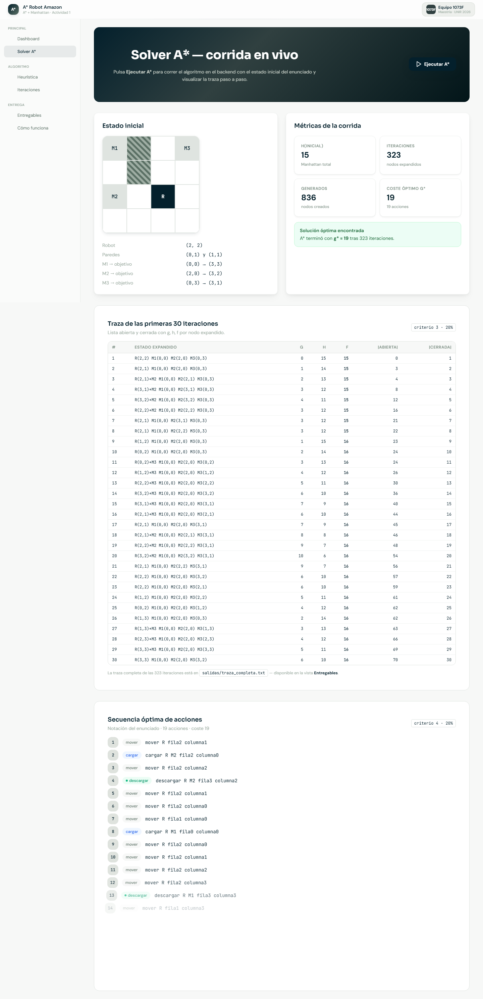
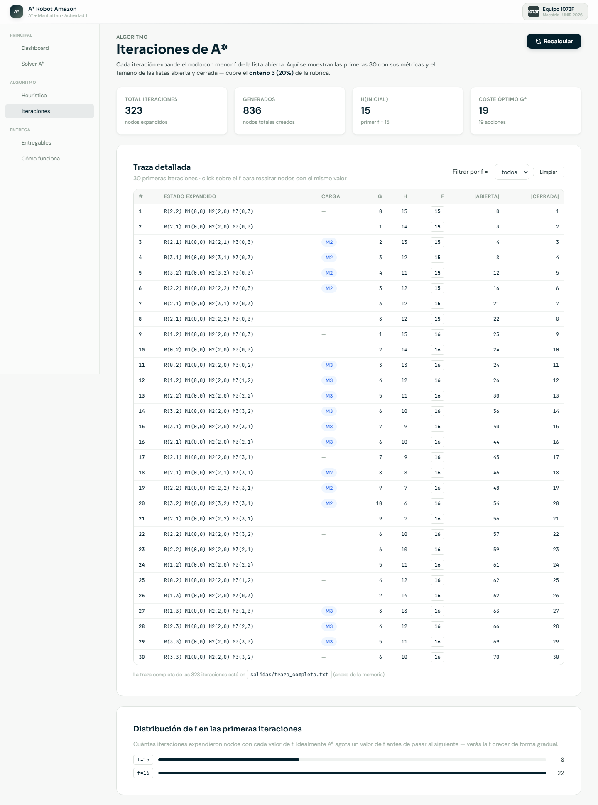

# Resolución de un problema mediante búsqueda heurística

**Actividad grupal · Algoritmo A\* aplicado al problema del Robot Amazon**

**Asignatura:** Razonamiento y planificación automática — Primer Semestre

**Universidad:** Universidad Internacional de La Rioja (UNIR) — Máster Universitario en Inteligencia Artificial

**Equipo 1073F:**

- Adonai Samael Hernandez Mata
- Diego Alfonso Najera Ortiz
- Mauricio Alberto Alvares Aspeitia
- Cesar Ivan Martinez Perez

**Fecha:** Abril 2026

---

## 1. Análisis del problema

Amazon necesita un robot autónomo que reordene tres inventarios (`M1`, `M2`,
`M3`) dentro de un almacén modelado como una matriz **4×4**. La matriz tiene
dos paredes (`#`) en `(0,1)` y `(1,1)` que el robot no puede atravesar. El
robot inicia en `(2,2)` y debe llevar cada inventario desde su posición
inicial hasta su posición objetivo:

| Inventario | Inicial | Objetivo |
|---|---|---|
| M1 | (0,0) | (3,3) |
| M2 | (2,0) | (3,2) |
| M3 | (0,3) | (3,1) |

Cada acción del robot —mover en una de las cuatro direcciones cardinales,
cargar un inventario, o descargarlo— tiene **coste real `g = 1`**. Como
heurística obligatoria se utiliza la **distancia de Manhattan**. La Figura 1
muestra el estado inicial renderizado por la herramienta.

## 2. Decisiones de modelado

Suposiciones explícitas tomadas del enunciado:

1. **Cargar y descargar son adyacentes** — el robot no pisa la celda del
   inventario, está en una contigua; única opción consistente con "el robot
   no puede entrar a casilla ocupada por inventario que no carga".
2. **El inventario cargado viaja con el robot**; la celda origen queda libre.
3. **Robot lleva un inventario a la vez** y **su posición final es libre**.
4. **Notación de acciones** según enunciado: `mover R fila{f} columna{c}`,
   `cargar R M{i} fila{f} columna{c}`, `descargar R M{i} fila{f} columna{c}`.

### Estructuras de datos

| Estructura | Implementación | Propósito |
|---|---|---|
| `Estado` | `@dataclass(frozen=True, slots=True)` | Robot, qué carga, posiciones de M1/M2/M3. Inmutable y hasheable. |
| `Nodo` | `@dataclass(frozen=True)` | Estado, padre, acción, `g`, `h`. `f = g + h`. |
| `Frontera` | `heapq` | Cola de prioridad por `(f, h, contador FIFO)`. |
| `Cerrada` | `dict[Estado, int]` | Estado → mejor `g` conocido. |

## 3. Heurística

`h(n) = Σ manhattan(Mi, obj_Mi) + max(0, manhattan(R, M_más_cercano)-1)` cuando
el robot no carga nada (-1 porque cargar es desde celda **adyacente**).

**Admisibilidad.** Ignora paredes, ignora la mecánica de carga/descarga (cada
una añade 1 al coste real) y no fuerza orden de inventarios — cada factor
solo puede *aumentar* el coste real, por lo que la suma es cota inferior.

**Verificación para el estado inicial:**

| Componente | Cálculo | Valor |
|---|---|---|
| M1: (0,0) → (3,3) | 3+3 | 6 |
| M2: (2,0) → (3,2) | 1+2 | 3 |
| M3: (0,3) → (3,1) | 3+2 | 5 |
| Ajuste robot → M2: max(0, 2-1) | | 1 |
| **Total `h(inicial)`** | | **15** |

`g(inicial) = 0`, `f(inicial) = 15`.

## 4. Algoritmo A\*

Implementación estándar con dos refinamientos:

1. **Desempate explícito** — empate de `f` se resuelve por menor `h` y luego
   por orden FIFO (contador monótono), garantizando reproducibilidad.
2. **Cerrada por mejor-g** — `dict[Estado, int]` con el mejor `g` conocido;
   un estado puede reabrirse si llega con `g` estrictamente mejor.

```python
abierta.push(Nodo(s0, padre=None, accion=None, g=0, h=h(s0)))
cerrada = {}
while not abierta.vacia():
    n = abierta.pop()                       # menor f, luego h, luego FIFO
    if n.estado in cerrada and cerrada[n.estado] <= n.g:
        continue
    cerrada[n.estado] = n.g
    if es_objetivo(n.estado):
        return reconstruir_camino(n)
    for accion, sucesor in sucesores(n.estado):
        g2 = n.g + 1
        if sucesor in cerrada and cerrada[sucesor] <= g2:
            continue
        abierta.push(Nodo(sucesor, n, accion, g2, h(sucesor)))
```

## 5. Plan de acción y desarrollo

| Fase | Entregable |
|---|---|
| 1 | Confirmación de suposiciones del modelado (carga adyacente, etc.) |
| 2 | `estado.py`, `acciones.py`, `heuristica.py` |
| 3 | `nodo.py`, `frontera.py`, `astar.py` |
| 4 | `traza.py` y `main.py` (cumple criterios 2 y 3 de la rúbrica) |
| 5 | Tests unitarios (`pytest`/`unittest`) |
| 6 | Corrida final, captura de salida, redacción de la memoria |

## 6. Pruebas realizadas

**24 pruebas** con `unittest` (Ran 24 tests in 0.041s — OK):

| Archivo | Verifica |
|---|---|
| `test_heuristica.py` | Manhattan en valores conocidos, `h(inicial)=15`, admisibilidad. |
| `test_sucesores.py` | Movimientos válidos, no pisa paredes/inventarios, cargar adyacente. |
| `test_astar.py` | Caso trivial, problema completo, coste óptimo = **19 acciones**. |
| `test_secuencia.py` | Simulación inversa al estado objetivo; notación correcta; 3 cargas / 3 descargas. |

## 7. Resultado de la corrida final

```
Iteraciones (nodos expandidos): 323
Nodos generados:                836
Coste total g(objetivo):        19
Longitud de la secuencia:       19
```

**Secuencia de acciones óptima** (notación del enunciado):

```
 1. mover R fila2 columna1            11. mover R fila2 columna2
 2. cargar R M2 fila2 columna0        12. mover R fila2 columna3
 3. mover R fila2 columna2            13. descargar R M1 fila3 columna3
 4. descargar R M2 fila3 columna2     14. mover R fila1 columna3
 5. mover R fila2 columna1            15. cargar R M3 fila0 columna3
 6. mover R fila2 columna0            16. mover R fila2 columna3
 7. mover R fila1 columna0            17. mover R fila2 columna2
 8. cargar R M1 fila0 columna0        18. mover R fila2 columna1
 9. mover R fila2 columna0            19. descargar R M3 fila3 columna1
10. mover R fila2 columna1
```

> La traza completa por iteración (listas abierta y cerrada con `g`, `h`, `f`
> de cada nodo) se incluye en el anexo `salidas/traza_corrida_final.txt`. La
> traza con detalle exhaustivo de las 323 iteraciones está en
> `salidas/traza_completa.txt`.

### 7.1 Tabla de las primeras iteraciones

Primeras 3 iteraciones tal cual las imprime el programa (verificación
contra traza manual; las 323 completas en `salidas/traza_completa.txt`):

```
=== Iteracion 1 ===  [g=0 h=15 f=15]  R(2,2) M1(0,0) M2(2,0) M3(0,3)
   ABIERTA: (vacia)            CERRADA: { R(2,2) [g=0] }

=== Iteracion 2 ===  [g=1 h=14 f=15]  R(2,1)
   ABIERTA: R(1,2) f=16, R(2,3) f=16, R(3,2) f=17
   CERRADA: R(2,2) [g=0], R(2,1) [g=1]

=== Iteracion 3 ===  [g=2 h=13 f=15]  R(2,1) carga=M2     <-- carga M2
   ABIERTA: R(1,2) f=16, R(2,3) f=16, R(3,1) f=17, R(3,2) f=17
   CERRADA: ..., R(2,1)+M2 [g=2]
```

`f` se mantiene constante en 15 durante el descenso óptimo: mientras `g`
crece, `h` decrece — la heurística está bien calibrada en la región crítica.

## 8. Pantallazos del proceso

Capturas de la herramienta interactiva (Forest Design System sobre Tailwind 4)
que envuelve al solver. El ZIP de entrega incluye las 7 capturas completas.



*Figura 1. Resultado de A\* — KPIs y secuencia óptima de 19 acciones (criterios 2 y 4).*



*Figura 2. Vista "Iteraciones" — traza con g, h, f y tamaño de listas abierta/cerrada por iteración (criterio 3).*

## 9. Dificultades encontradas

1. **Modelo de carga ambiguo.** El enunciado no fija si "cargar" se hace
   sobre la celda del inventario o desde adyacente. La regla "el robot no
   puede entrar a casilla ocupada por inventario" obliga a **carga adyacente**.
2. **Volumen de la traza.** 323 iteraciones imprimiendo la cerrada completa
   producen ~139k líneas. Se añadió un modo "primeras N detalladas + resto
   resumido" sin perder la traza completa como anexo.
3. **Desempate reproducible.** Sin criterio explícito el orden cambia entre
   corridas. Se resolvió con `(f, h, contador FIFO)` en `heapq`.
4. **Encoding Windows.** Stdout en CP1252 corrompía no-ASCII; se fuerza UTF-8
   con `PYTHONIOENCODING=utf-8` y se evitan caracteres conflictivos.

## 10. Cómo ejecutar

Desde `astar_robot_amazon/` con Python 3.10+:

```bash
python -m backend.app.solver.main                    # corrida con traza compacta
python -m backend.app.solver.main --completa         # 323 iteraciones detalladas
python -m unittest discover -s backend/tests          # 24 tests
```

## 11. Referencias bibliográficas (APA)

- Russell, S. J., & Norvig, P. (2021). *Artificial Intelligence: A Modern Approach* (4th ed.). Pearson.
- Hart, P. E., Nilsson, N. J., & Raphael, B. (1968). A formal basis for the heuristic determination of minimum cost paths. *IEEE Transactions on Systems Science and Cybernetics*, 4(2), 100–107. https://doi.org/10.1109/TSSC.1968.300136
- Pearl, J. (1984). *Heuristics: Intelligent search strategies for computer problem solving*. Addison-Wesley.
- Python Software Foundation. (2025). *Python 3.13 documentation — heapq, dataclasses*. https://docs.python.org/3.13/

## Anexo A — Estructura del código fuente

```
astar_robot_amazon/
├── backend/
│   ├── app/
│   │   └── solver/
│   │       ├── estado.py          # Estado inmutable, paredes, objetivo
│   │       ├── acciones.py        # TipoAccion + sucesores válidos
│   │       ├── heuristica.py      # Manhattan + h(n) admisible
│   │       ├── nodo.py            # Nodo del árbol + reconstrucción del camino
│   │       ├── frontera.py        # Cola de prioridad con desempate explícito
│   │       ├── traza.py           # Render del tablero y salida por iteración
│   │       ├── astar.py           # Algoritmo principal
│   │       └── main.py            # Entry point con argumentos CLI
│   └── tests/                     # 24 tests unitarios
├── salidas/
│   ├── traza_corrida_final.txt    # Salida resumida (anexo principal)
│   └── traza_completa.txt         # Todas las iteraciones detalladas
└── memoria/
    └── memoria.md                 # Este documento
```

## Anexo B — Código fuente

> *(Adjuntar los archivos del directorio `backend/app/solver/` y
> `backend/tests/` como anexo. No cuentan para el límite de 10 páginas.)*
